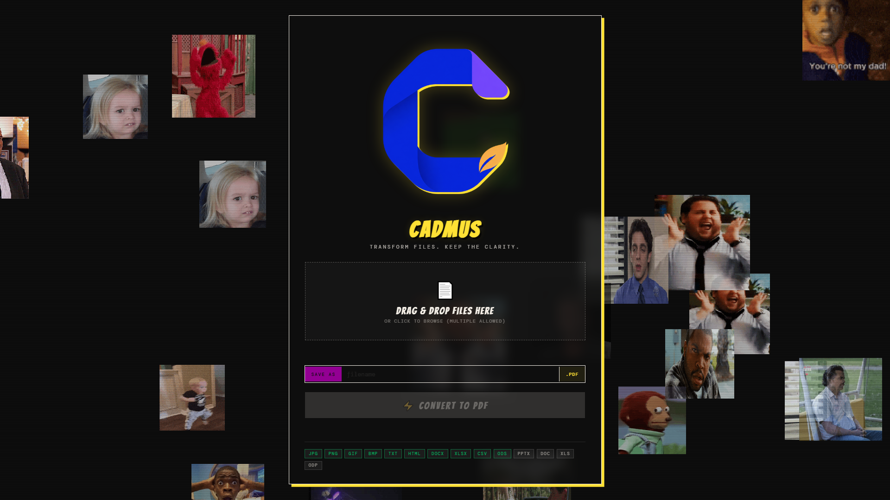
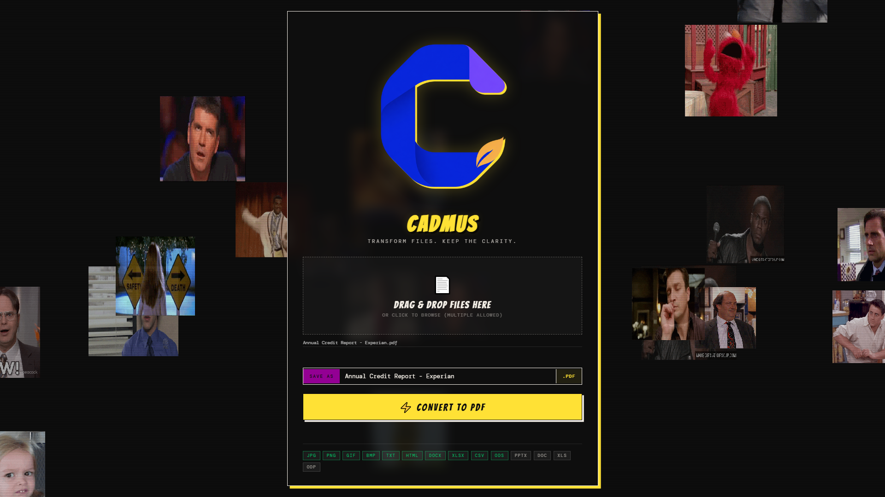

<p align="center">
  
</p>

<h1 align="center">Cadmus</h1>

<p align="center">
  <strong>Transform files. Keep the clarity.</strong><br>
  A local, drag-and-drop desktop app for turning everyday files into PDFs.
</p>

<p align="center">
  <a href="#quick-start">Quick start</a> ·
  <a href="#what-cadmus-can-do">Features</a> ·
  <a href="#supported-formats">Formats</a> ·
  <a href="#why-cadmus">Why Cadmus?</a>
</p>

---

Cadmus keeps document conversion straightforward: drop a file into the app, choose a name, and get a PDF saved locally. It runs on your machine, supports batches and merging, and never needs LibreOffice for its advertised formats.

## See it in action

<p align="center">
  
  
</p>

## Quick start

### Run from source

Cadmus requires Python 3.9 or newer.

```bash
pip install -r requirements.txt
python cadmus.py
```

### Build the Windows app

```bash
pip install -r requirements.txt pyinstaller
pyinstaller Cadmus.spec
```

The finished application is written to `dist/Cadmus.exe`.

## What Cadmus can do

| Capability | What it does |
| --- | --- |
| Single conversion | Turn one supported file into a PDF with a custom output name. |
| Batch conversion | Convert multiple files in one pass while keeping their original names. |
| PDF merging | Combine two or more PDFs—or a mix of supported source files—into one document. |
| Image OCR | Create a searchable PDF from an image when Tesseract OCR is installed. |
| Workbook export | Include every sheet from XLSX and ODS workbooks. |
| Safe output | Keeps existing PDFs by adding ` (2)`, ` (3)`, and so on instead of overwriting them. |

## Supported formats

| Input | Native conversion |
| --- | --- |
| PDF | Copy or merge pages |
| JPG, JPEG, PNG, BMP, GIF | Image-to-PDF, with optional OCR |
| TXT | Text-to-PDF |
| HTML | HTML-to-PDF |
| DOCX | Document text and supported formatting-to-PDF |
| XLSX, CSV, ODS | Table-to-PDF; XLSX and ODS include all sheets |

Cadmus deliberately does not advertise legacy Office formats such as `.doc`, `.xls`, `.pptx`, or `.odp`; reliable rendering of those formats needs a separate office engine.

## OCR setup

OCR is optional. To make image PDFs searchable, install [Tesseract OCR](https://github.com/tesseract-ocr/tesseract) and ensure `tesseract` is available on your `PATH`.

On Windows, its common installation path is:

```text
C:\Program Files\Tesseract-OCR\tesseract.exe
```

## Where files go

Cadmus saves completed files locally in:

```text
~/Cadmus_Output
```

Use **Open Folder** in the app to jump there after a conversion.

## Why Cadmus?

Cadmus is a figure from Greek mythology traditionally associated with bringing the alphabet to Greece. The name suits an app that helps documents move cleanly from one form into another. Its mark is a flowing **C** that suggests a folded page, while the laurel detail nods to that Greek origin and to the idea of a finished, polished document.

## Development

Install the development dependencies and run the tests:

```bash
pip install -r requirements-dev.txt
pytest
```

## License

Cadmus is available under the [MIT License](LICENSE).
